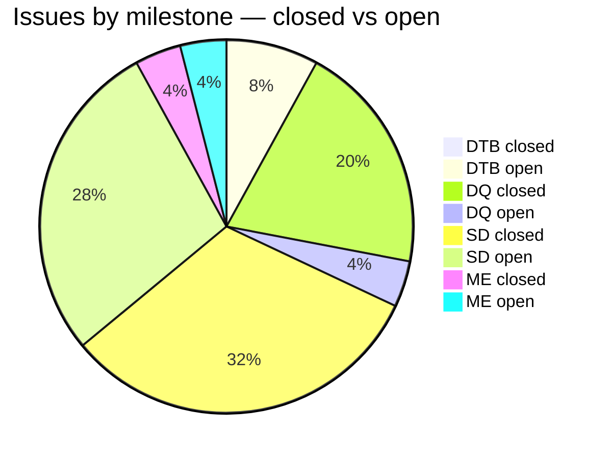
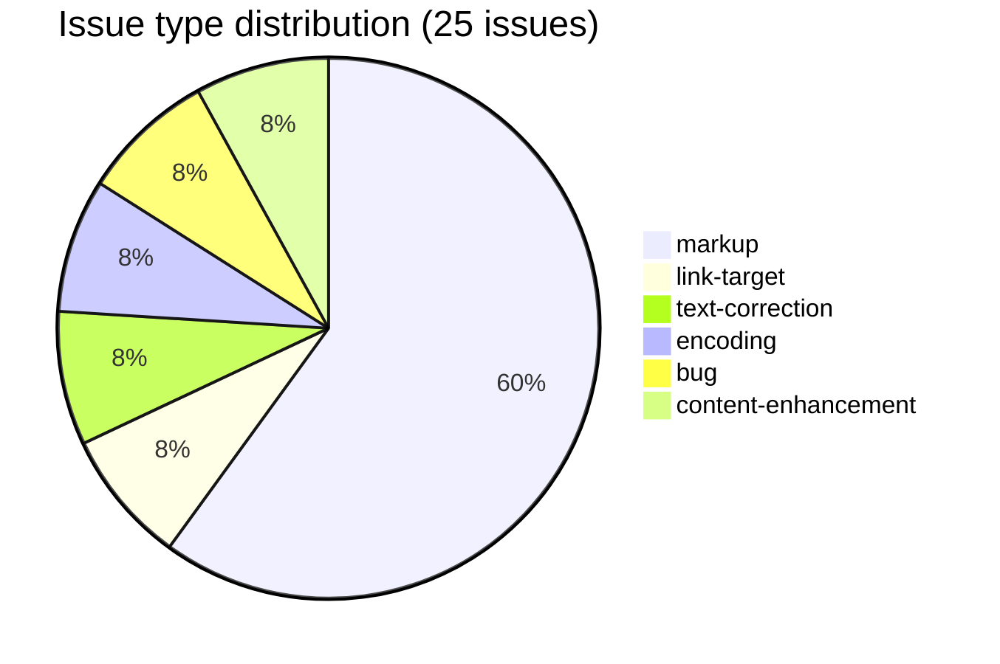

# AP — Apte Sanskrit-English Dictionary (1957)

Collaborative tools for parsing, validating, and improving the digitised Apte Sanskrit-English dictionary, as part of the [Sanskrit Lexicon project](https://github.com/sanskrit-lexicon).

The upstream dictionary lives at [csl-orig/v02/ap/ap.txt](https://github.com/sanskrit-lexicon/csl-orig). This repo contains the scripts and issue-by-issue workflow used to clean and enhance it.

---

## Project Timeline

| Period | Milestone |
|--------|-----------|
| **Jul 2025** | Project started — 28 historical diff files created, git history established (Issue 1) |
| **Jan 2026** | Tooltip activation for `<ab>` and `<ls>` elements; extended ASCII handling (Issues 2–4) |
| **Feb 2026** | `<lex>` and `<lang>` markup; Sanskrit global character corrections (Issues 3, 6) |
| **Apr 2026** | Major pipeline built for separating hidden headwords; **8,518 new entries extracted**, growing the dictionary from 79,815 → 88,333 entries (Issues 16, 23) |
| **May 2026** | Parenthetical suffix patterns handled; link targets documented (Issues 19, 25) |

---

## How It Works

Work is organised into numbered `issues/` directories. Each issue targets a specific problem in the dictionary data and follows a step-by-step Python pipeline:

```
csl-orig/v02/ap/ap.txt   ← upstream source
        ↓
    tmp_ap_0.txt          local working copy
        ↓  step2.py       main transformation
    tmp_ap_2.txt + log2.tsv
        ↓  step3.py       validate against Sanskrit word list
    log3.tsv
        ↓  step4.py       assign permanent entry numbers
    tmp_ap_4.txt
        ↓  (manual fixes if needed)
        ↓  git merge-file
    csl-orig/v02/ap/ap.txt  ← committed back upstream
```

To re-run an issue pipeline from scratch:

```bash
cd issues/issue25
bash redo.sh
```

---

## Projects & Milestones

| Milestone | Project | Total | Open | Closed |
|---|---|---|---|---|
| Dictionary to Book (1) | Project 1 | 2 | 2 | 0 |
| Digitization Quality (2) | Project 2 | 6 | 1 | 5 |
| Structured Data (3) | Project 3 | 15 | 7 | 8 |
| Major Enhancements (4) | Project 4 | 2 | 1 | 1 |
| **Total** | | **25** | **11** | **14** |





---

## Issue Typology

### Solved (14 closed)

| # | Type | Severity | Summary |
|---|---|---|---|
| #1 | content-enhancement | medium | Making AP public — initial release |
| #2 | markup | medium | `<ab>` and `<ls>` tooltips |
| #3 | text-correction | minor | `b`→`v` Sanskrit global character corrections |
| #4 | encoding | minor | Extended ASCII handling |
| #6 | markup | minor | Tooltips for gender (`<lex>` tags) |
| #7 | text-correction | minor | Global changes continued from #3 |
| #8 | markup | medium | Study of ap57_AB_v4a abbreviation version |
| #12 | markup | medium | AP with compounds and alternate headwords |
| #16 | markup | minor | Upgrade hidden headwords |
| #20 | markup | minor | 27 failed automatic resolutions |
| #21 | bug | minor | Resolution absent in sanhw1.txt |
| #23 | markup | minor | Pattern `^.({@{#` extraction |
| #24 | bug | minor | L-id ordering issues |
| #25 | markup | minor | Inline `({@{#-XXXX#}@})` pattern |

### Open (11 open)

| # | Type | Severity | Summary |
|---|---|---|---|
| #5 | markup | minor | `<s>` element inside `<ls>` element |
| #9 | markup | medium | Alternate headwords of main entries |
| #10 | markup | medium | Compound headwords preparation |
| #13 | encoding | minor | `€` in data — class number encoding |
| #14 | link-target | medium | Activate link targets — tooltips |
| #15 | markup | medium | Compound headword scope and resolution |
| #17 | markup | minor | One more pattern missing for headword identification |
| #18 | markup | minor | Third pattern |
| #19 | link-target | medium | Activate link targets — identify targets |
| #22 | markup | medium | Compound analysis |
| #26 | content-enhancement | medium | Add compounds to compounds list |

---

## Labels

**Type** (one per issue): `link-target` · `link-splitting` · `markup` · `text-correction` · `content-enhancement` · `encoding` · `scan-quality` · `bug` · `question`

**Severity** (one per issue): `minor` · `medium` · `hard`

---

## Contributors

| Contributor | Role |
|-------------|------|
| **Dr. Dhaval Patel** | Lead developer — 75 commits |
| **Jim Funderburk** (funderburkjim) | Core contributor — 49 commits |
| **Mārcis Gasūns** | Documentation |

---

## Repository Layout

```
issues/
  issue1/    Git history tracking, historical diffs of ap.txt
  issue2/    <ab> and <ls> tooltips
  issue3/    Global Sanskrit character corrections
  issue4/    Extended ASCII handling
  issue16/   Suffix separation pipeline (step2–step4)
  issue23/   Hidden headword extraction (.{@{#-suffix#}@} pattern)
  issue25/   Parenthetical suffix extraction (({@{#-suffix#}@}) pattern)
  ...
```

For technical details on the pipeline and dictionary format, see [CLAUDE.md](CLAUDE.md).
