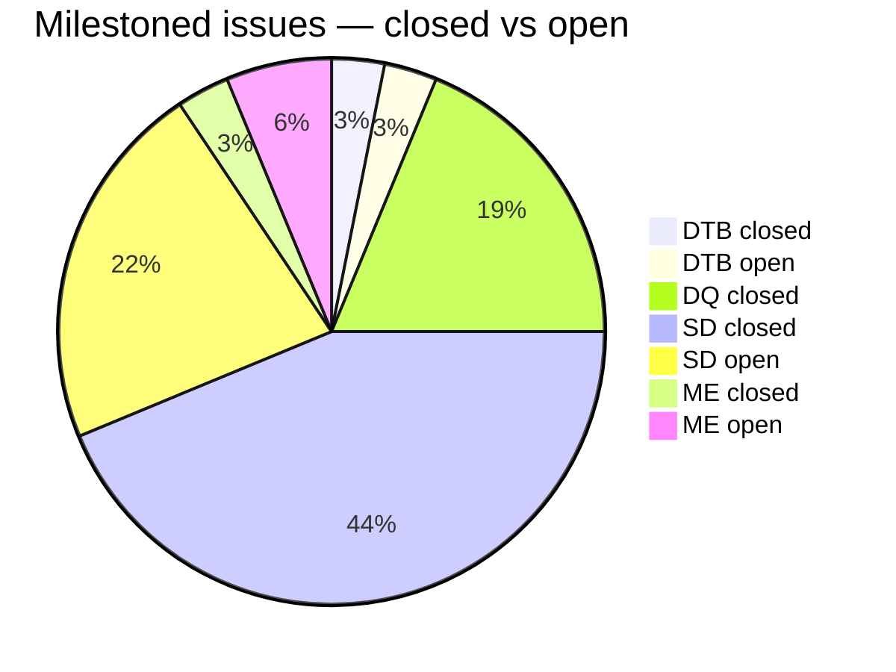

# AP — Apte Sanskrit-English Dictionary (1957)

_Created: 06-07-2025 · Last updated: 11-07-2026_

Collaborative tools for parsing, validating, and improving the digitised Apte
Sanskrit-English dictionary, as part of the
[Sanskrit Lexicon project](https://github.com/sanskrit-lexicon).

The upstream dictionary lives at
[csl-orig/v02/ap/ap.txt](https://github.com/sanskrit-lexicon/csl-orig). This repo
contains the scripts and issue-by-issue workflow used to clean and enhance it.

Corrections are never committed directly to `csl-orig`; they are prepared,
validated, and delivered as a consolidated batch pull request following the
canonical
[correction workflow](https://github.com/sanskrit-lexicon/csl-corrections/blob/main/docs/correction-workflow.md).

---

## Project Timeline

| Period | Milestone |
|--------|-----------|
| **Jul 2025** | Project started — 28 historical diff files created, git history established (Issue 1) |
| **Jan 2026** | Tooltip activation for `<ab>` and `<ls>` elements; extended ASCII handling (Issues 2–4) |
| **Feb 2026** | `<lex>` and `<lang>` markup; Sanskrit global character corrections (Issues 3, 6) |
| **Apr 2026** | Major pipeline built for separating hidden headwords; hidden-headword extraction growing the entry count (Issues 16, 23) |
| **May 2026** | Parenthetical suffix patterns handled; link targets documented (Issues 19, 25) |
| **Jun–Jul 2026** | Markup-oddities fixes landed; homonym-number and artificial-homonym work opened; repo hardening (CodeQL/Semgrep SAST, Dependabot, SEO landing page) |

---

## How It Works

**Operator manual:**
[docs/PIPELINE_MANUAL.md](https://github.com/sanskrit-lexicon/AP/blob/main/docs/PIPELINE_MANUAL.md)
— the hidden-headword step pipeline, the L-number system, per-folder map,
delivery idiom, symptom→cure and maintainer appendix (metadoc:
[docs/PIPELINE_MANUAL.meta.md](https://github.com/sanskrit-lexicon/AP/blob/main/docs/PIPELINE_MANUAL.meta.md)).

Work is organised into numbered
[issues/](https://github.com/sanskrit-lexicon/AP/tree/main/issues) directories.
Each issue targets a specific problem in the dictionary data and follows a
step-by-step Python pipeline:

```text
csl-orig/v02/ap/ap.txt   ← upstream source
        ↓
    tmp_ap_0.txt          local working copy
        ↓  step2.py       main transformation
    tmp_ap_2.txt + log2.tsv
        ↓  step3.py       validate against Sanskrit word list
    log3.tsv
        ↓  step4.py       assign permanent entry numbers
    tmp_ap_4.txt
        ↓  (manual fixes if needed)
        ↓  git merge-file
    csl-orig/v02/ap/ap.txt  ← delivered upstream by batch PR
```

To re-run an issue pipeline from scratch:

```bash
cd issues/issue25
bash redo.sh
```

---

## Issues — current state

Live counts as of **11-07-2026** (source of truth: the
[GitHub issue tracker](https://github.com/sanskrit-lexicon/AP/issues)):
**44 issues total — 11 open, 33 closed.**

| Milestone | Open | Closed | Total |
|---|---|---|---|
| [Dictionary to Book](https://github.com/sanskrit-lexicon/AP/milestone/1) | 1 | 1 | 2 |
| [Digitization Quality](https://github.com/sanskrit-lexicon/AP/milestone/2) | 0 | 6 | 6 |
| [Structured Data](https://github.com/sanskrit-lexicon/AP/milestone/3) | 7 | 14 | 21 |
| [Major Enhancements](https://github.com/sanskrit-lexicon/AP/milestone/4) | 2 | 1 | 3 |
| _Unmilestoned_ (maintenance / dependency bumps) | 1 | 11 | 12 |
| **Total** | **11** | **33** | **44** |



### Open issues (11)

| # | Type | Severity | Summary |
|---|---|---|---|
| [#14](https://github.com/sanskrit-lexicon/AP/issues/14) | link-target | medium | Activate link targets — tooltips |
| [#15](https://github.com/sanskrit-lexicon/AP/issues/15) | markup | medium | Compound headword scope for diff resolution |
| [#17](https://github.com/sanskrit-lexicon/AP/issues/17) | markup | minor | One more pattern missing for headword identification |
| [#18](https://github.com/sanskrit-lexicon/AP/issues/18) | markup | minor | Third pattern |
| [#22](https://github.com/sanskrit-lexicon/AP/issues/22) | markup | medium | Compound analysis |
| [#26](https://github.com/sanskrit-lexicon/AP/issues/26) | content-enhancement | medium | Add compounds to compounds list |
| [#27](https://github.com/sanskrit-lexicon/AP/issues/27) | markup | minor | `━II`, `━III` etc. denote different verbs altogether |
| [#34](https://github.com/sanskrit-lexicon/AP/issues/34) | markup | — | Add homonym numbers |
| [#35](https://github.com/sanskrit-lexicon/AP/issues/35) | question | minor | How to display the resolved compounds in AP? |
| [#36](https://github.com/sanskrit-lexicon/AP/issues/36) | content-enhancement | medium | Add artificial homonyms while displaying results (similar to MW) |
| [#37](https://github.com/sanskrit-lexicon/AP/issues/37) | markup | minor | Inline `({@{#-XXXX#}@})` |

Closed issues are best browsed on the
[tracker](https://github.com/sanskrit-lexicon/AP/issues?q=is%3Aissue+is%3Aclosed);
they cover the initial public release, `<ab>`/`<ls>`/`<lex>` tooltips, extended
ASCII and Sanskrit global character corrections, the hidden-headword extraction
pipeline (issues 16, 23, 25), L-id ordering, and repository hardening.

---

## Labels

**Type** (one per issue): `link-target` · `link-splitting` · `markup` ·
`text-correction` · `content-enhancement` · `encoding` · `scan-quality` · `bug`
· `question`

**Severity** (one per issue): `minor` · `medium` · `hard`

---

## Contributors

Commit counts from the
[GitHub contributor graph](https://github.com/sanskrit-lexicon/AP/graphs/contributors),
as of 11-07-2026:

| Contributor | Role | Commits |
|-------------|------|---------|
| **Dr. Dhaval Patel** (drdhaval2785) | Lead developer | 82 |
| **Jim Funderburk** (funderburkjim) | Core contributor | 49 |
| **Mārcis Gasūns** (gasyoun) | Documentation | 25 |

---

## Repository Layout

```text
issues/
  issue1/    Git history tracking, historical diffs of ap.txt
  issue2/    <ab> and <ls> tooltips
  issue3/    Global Sanskrit character corrections
  issue4/    Extended ASCII handling
  issue16/   Suffix separation pipeline (step2–step4)
  issue23/   Hidden headword extraction (.{@{#-suffix#}@} pattern)
  issue25/   Parenthetical suffix extraction (({@{#-suffix#}@}) pattern)
  ...
```

For technical details on the pipeline and dictionary format, see
[CLAUDE.md](https://github.com/sanskrit-lexicon/AP/blob/main/CLAUDE.md).

_Dr. Mārcis Gasūns_
